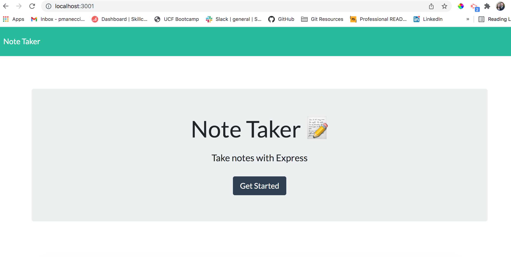

# Trapper-Keeper

## Description

A node-based web app for creating and retrieving notes.

## Table Of Contents

- [trapper-keeper](#trapper-keeper)
  - [Description](#description)
  - [Table Of Contents](#table-of-contents)
  - [Installation](#installation)
  - [Usage](#usage)
  - [Tests](#tests)
  - [Questions](#questions)

## Installation

To install locally, clone this repository to your local environment.  This is a node application, so node must be installed.  If you need to install node, check out this link  https://nodejs.org/en/download/.  Once node (and npm) are installled, attach to the repository root directory and update npm dependencies with the following commands:

* npm install
* npm install jest
* npm install express
* npm install fs-extra
* npm install short-unique-id

## Usage

To execute the application click on the following Heroku deployed link:
https://shrouded-sierra-05403.herokuapp.com/

If you'd like, you can execute the app locally.  Follow the "Installation" instructions above.  Start up the application server with the command; 'npm start', or 'node server.js' from within the root directory of the cloned repository. 

## Tests

Used Jest to unit test the ./lib/notes.js middleware functionality.  From the root directory execute the following test (there is only one test suite with 4 tests):  
* npm run test
  
## Questions

Any questions, please contact Patty Manecci

My email address is: pmanecci@gmail.com
My github profile is https://github.com/PManecci
